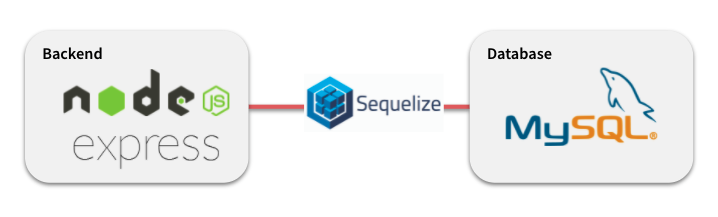
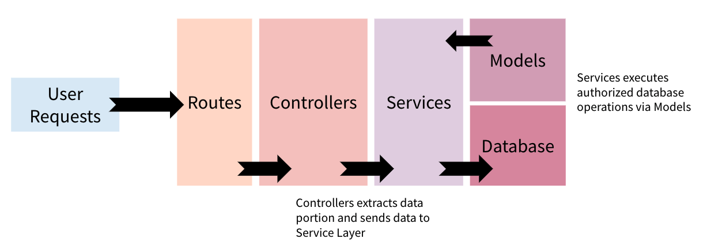

# Assessment---GovTech

Author : Tin Kit Wong

## Setup

1. Setup mySQL and mySQL workbench (optional)
    - Install MySQL https://dev.mysql.com/downloads/mysql/
    - Install MySQL WorkBench https://www.mysql.com/products/workbench/
    - Use MySQL WorkBench to connect to MySQL locally.
    - Create a database named testdb `CREATE DATABASE testdb;`
    - Update PASSWORD field in ~/db/config/db.config.js

2. Install dependencies `yarn install`


## Usage
```bash
# starts server
yarn run dev

# test suites
yarn run test
```

## API Routes

Note : API Usage via Postman Collections; Download and import Postman Collections into your Personal Workspace and follow the examples given. Please see the description and examples of each EndPoint provided. 

1. Household
- [X] Create Household 
  - http://localhost:8080/api/household/create
- [X] Add a Family Member to Household
  - http://localhost:8080/api/household/addMember
- [X] List Households
  - http://localhost:8080/api/household/
- [X] Show Household
  - http://localhost:8080/api/household/:id
- [X] Delete Household
  - http://localhost:8080/api/household/delete/:id
- [X] Delete Family Member from Household
  - http://localhost:8080/api/household/removeMember


2. Grants
- [X] Search for households and recipients of grant disbursement 
  - http://localhost:8080/api/grants/checkElligibility

3. Person
- [X] http://localhost:8080/api/person/create

## Architecture

### Tech Stack



1. NodeJs / Express 
2. Sequelize ORM
3. MySQL 

### Framework


1. Leverages on MVC (Model-View-Controller) Architecture
2. HTTP Requests handled at the Route Layer -> Controller Layer -> Services (which iteracts with DB Models) -> Database
3. MVC helps to regulate the complexity of application by dividing into their respective layers/parts (ie. model, view and controller)
4. This shows that each layer has a specific duty, allowing development & testing within each layer with a clear objective. 


## Assumptions on API

### General Assumptions 
1. Omission of View Component in MVC Architecture as there is no functional requirement. Can consider setting up views for visualisation requirements like backend dashboard
2. Usage of MySQL due to structured and relational nature of data (ie. Households can have many family members, Persons have many metadata)

### Assumptions / Inferences on Requirements
1. Household must exist before Person can be added as Family Members to this Household
2. Only expected/valid HousingTypes, OccupationTypes can be added. Define them in `app_root_dir/utils/constants.js`
3. The selection criteria for grant disbursement API Endpoint (/api/grants/checkElligibility) checks for households:
   - householdSize <= the quried size
   - household income <= the queried totalIncome
4. There must be existing household and recipients elligible for grants for grant disbursement API EndPoint to work. 